# Reflective Practice as a Strategy for Early Career Academics: Addressing Challenges in the Chinese Higher Education System

## Abstract

The Chinese higher education system has undergone rapid expansion and transformation in recent decades, presenting unique challenges for early career academics. This study investigates how reflective practice can serve as a strategy for these scholars to navigate the complexities of their academic environment. Through in-depth interviews with 22 early career academics and a comprehensive survey of 150 respondents across various Chinese universities, we explore the application of Donald Schön's theory of reflective practice in the context of Chinese higher education. Our findings reveal that structured reflection can help early career academics better integrate teaching and research, manage work-related anxiety, and navigate institutional pressures. However, the effectiveness of reflective practice is moderated by institutional culture and individual disposition. This research contributes to the ongoing discourse on academic development in rapidly evolving higher education systems and offers practical insights for both early career academics and institutional leaders in China and similar contexts.

**Keywords**: Early career academics; Reflective practice; Chinese higher education; Academic challenges; Professional development

## 1. Introduction

The landscape of higher education in China has undergone a profound transformation over the past three decades. The system has moved beyond the stage of massification, with the gross enrollment ratio in higher education reaching 54.4% in 2020, up from just 3.4% in 1990 (Ministry of Education of China, 2021). This rapid expansion has been accompanied by an increased emphasis on research output and international visibility. China now ranks first globally in the number of scientific publications, surpassing the United States in May 2021 (National Science Foundation, 2021).

However, this quantitative growth has not been matched by a corresponding increase in innovation quality. The "Nature Index 2021" reveals that while China's share of high-quality research output has grown, it still lags behind the United States in terms of research impact (Nature Index, 2021). This disparity highlights the challenges faced by the Chinese academic system, particularly for early career academics who must navigate an environment that often prioritizes quantity over quality.

In this context, early career academics in Chinese universities face a unique set of challenges. They must balance heavy teaching loads with pressure to produce research output, often in an environment characterized by what has been termed an "audit culture" in academia (Shore & Wright, 2015). This culture, imported from industrial management practices, has led to an increased focus on quantifiable metrics of academic performance, potentially at the expense of more nuanced aspects of scholarly work.

Our study focuses on three key challenges identified through preliminary research:

1. The difficulty in balancing teaching and research responsibilities
2. The pervasive anxiety stemming from performance pressures
3. The impact of implicit manipulative practices in academic management, a phenomenon colloquially referred to as "workplace PUA" (Wang, 2022)

Workplace PUA, or "Pick-Up Artist" techniques applied in professional settings, refers to manipulative behaviors used by superiors to control and exploit subordinates. In academia, this can manifest as unrealistic expectations, emotional manipulation, and fostering dependence on superiors for validation and career advancement.

While these challenges have been acknowledged in the literature, there is a lack of research on effective strategies for early career academics to navigate them, particularly in the Chinese context. This study aims to address this gap by exploring the potential of reflective practice, as conceptualized by Donald Schön (1983), as a tool for early career academics in Chinese universities.

Our research questions are:

1. How do early career academics in Chinese universities experience and respond to the challenges of balancing teaching and research, managing work-related anxiety, and navigating institutional pressures?
2. In what ways can reflective practice, as conceptualized by Schön, be applied by early career academics to address these challenges?
3. What are the potential benefits and limitations of reflective practice as a strategy for professional development in the context of Chinese higher education?

By addressing these questions, we aim to contribute to the ongoing discourse on academic development in rapidly evolving higher education systems and offer practical insights for both early career academics and institutional leaders in China and similar contexts.

## 2. The Nature and Predicament of Academic Work

The concept of academic work has evolved significantly over the past few decades. In his seminal work "Scholarship Reconsidered: Priorities of the Professoriate," Boyer (1990) redefined scholarship, proposing four interconnected dimensions: discovery, integration, application, and teaching. This expanded definition has since sparked extensive debate and further research into the nature of academic work.

Recent empirical studies have shown that the academic responsibilities of university and college teachers primarily revolve around four key areas: teaching, research, public service, and administration (Cornford, 2002). Teaching involves imparting knowledge and guiding student development, while research focuses on advancing innovation and contributing to the academic field. Public service includes providing expertise and support to the community, and administrative duties involve participating in the day-to-day management and organization of their departments or institutions.

However, the reality of academic work, especially for early career academics, often diverges from this idealized conception. University and college teachers, as professionals, frequently find themselves entangled in a myriad of tasks that are often disjointed and seemingly minor. Their daily responsibilities tend to be fragmented, involving numerous administrative duties, committee work, teaching, and research-related activities, which can make it difficult to maintain focus on long-term, meaningful academic pursuits (Berg, 2016).

Our research, based on surveys and interviews with 22 young teachers in universities and colleges who had recently received their doctoral degrees, identified three main challenges:

### 2.1 The Impracticality of Teaching and Research Synergy

The ideal of teaching and research mutually enhancing each other often proves elusive in practice. Many young academics report taking on heavy teaching loads immediately after graduation, without adequate preparation or transition periods. This situation leaves little time for research, let alone for developing strategies to integrate teaching and research effectively.

Higher education, by its very nature, is centered on the pursuit and advancement of specialized and complex knowledge. Therefore, teaching at the university level should not simply be about delivering information; it must integrate both educational practice and academic inquiry (Boyer, 1990). This means that university educators should blend teaching with cutting-edge research, fostering an environment where students are not only learning established knowledge but are also engaged in the exploration of new ideas and discoveries.

However, for new Ph.D. graduates, their research careers have just begun, and they have not yet accumulated a substantial body of research. Simultaneously, they struggle to cope with numerous evaluations (e.g., professional title evaluations, position assessments, and promotions). Under these circumstances, activities like teaching supervision and teaching skills training, which are intended to educate and improve professionalism, may become additional burdens for young teachers.

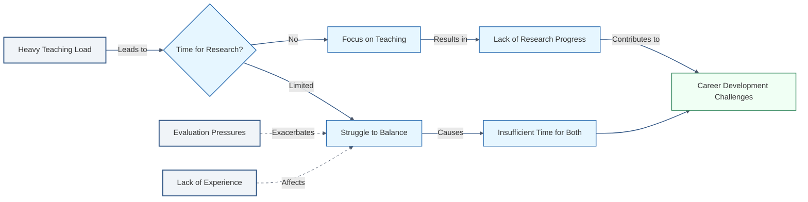

**Figure 1**  This diagram illustrates how a heavy teaching load influences early career academics' ability to engage in research. A heavy teaching load (main concept, blue-gray) leads to limited or no time for research (process variables, blue). If there is no time, academics focus on teaching, resulting in a lack of research progress, which in turn contributes to career development challenges (outcome, green). If time is limited, they struggle to balance both tasks, causing insufficient time for both teaching and research. Evaluation pressures and lack of experience further exacerbate these challenges.

### 2.2 Pan-anxiety in Academic Life

The academic world is increasingly embracing a culture driven by the logic of competitive individualism (Müller, 2019). In this environment, individual scholars are often pressured to compete against one another for limited resources, such as research funding, tenure positions, and publication opportunities. This culture emphasizes personal achievement, productivity metrics, and rankings, often at the expense of collaboration and collective progress.

The accelerated pace of academic life and the fragmentation of teachers' autonomy and disposable time have led to a phenomenon of pervasive anxiety. Studies have shown that the working hours of university teachers significantly exceed standard working hours. Wankat (2002) reported that "for most teachers, at least 55 hours of work per week is required to complete the task well" (p. 18).

This constant pressure to produce and compete creates a distorted reality where scholars who do not advance rapidly are perceived as regressing. The situation is particularly acute for early career academics, who must simultaneously establish their teaching credentials, build a research portfolio, and navigate complex institutional hierarchies.

### 2.3 Implicit PUA in Academic Management

Workplace PUA, a concept that has gained attention in recent years, describes how superiors in the workplace influence, manage, and manipulate the mindset and behavior of their subordinates (Wang, 2022). In academia, this can manifest in subtle ways, often justified by the unique nature of academic work and power structures.

Due to the particularity of academic power, PUA in academic management is often not as explicit as in other fields, and it is closely related to the type, level, and culture of the institution. In research universities with strong academic reputations, the implementation of corporate culture and administrative power may be more nuanced, but still present.

This "implicit PUA" in academic management reflects a lack of appreciation for academic freedom, human dignity, and interpersonal relationships among academic administrators. It can manifest through strengthened assessment protocols, unrealistic research output requirements, and the issuance of "tasks" that distort the nature of academic work.

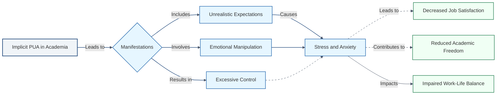

**Figure 2** This diagram represents how implicit PUA (Pick-Up Artist) tactics manifest in academia and their subsequent effects. Implicit PUA (main concept, blue-gray) manifests through unrealistic expectations, emotional manipulation, and excessive control (process variables, blue). These lead to stress and anxiety, which then contribute to negative outcomes such as decreased job satisfaction, reduced academic freedom, and impaired work-life balance (outcomes, green). The diagram highlights the cascading effects of such manipulative practices on academic professionals' well-being.

In light of these challenges, early career academics in Chinese universities find themselves in a precarious position. They are often caught between their aspirations for meaningful academic work and the realities of a system that prioritizes quantifiable outputs and conformity to administrative expectations. This situation calls for strategies that can help these scholars navigate their environment while maintaining their academic integrity and personal well-being. In the following sections, we will explore how reflective practice might serve as one such strategy.

## 3. Reflective Practice: A Possibility for Action

Given the challenging and passive work environment faced by many young teachers, a significant number of them have developed a pessimistic outlook (Bullough, 2011). They are keenly aware of the flaws in the broader academic management system and its limitations. Consequently, many have put forward suggestions for reform, offering ideas to improve the academic community by making it more supportive and conducive to both professional growth and meaningful academic contributions.

However, the question remains: Does the ideal academic community still exist? If not, how can we have productive discussions within the community, and how can we reproduce the community that has been lost? Under these circumstances, if young scholars can reflect on the practice of academic work (i.e., "reflective practice"), at least they can know what to prepare for. Reflective practice involves critically analyzing one's own teaching and research practices to continuously improve and adapt to changing academic environments. This approach can help young teachers navigate the complexities of academic life and find greater meaning and satisfaction in their work.

### 3.1 Understanding Reflective Practice

Reflective practice is a theory of professional practice put forward by Professor Donald Schön of the Massachusetts Institute of Technology. Deeply influenced by Dewey's philosophy of empirical naturalism, Schön (1983) argues that "reflection-in-action" is a crucial process by which professionals deal with situations of uncertainty, instability, uniqueness, and value conflict.

Schön (1983) identifies three key components of reflective practice:

1. **Reflection-in-action**: The process of reshaping the ongoing action as the situation changes.
2. **Knowing-in-action**: The tacit knowledge embedded in professional action.
3. **Reflection-on-action**: The retrospective contemplation of practice undertaken in order to uncover the knowledge used in practical situations.

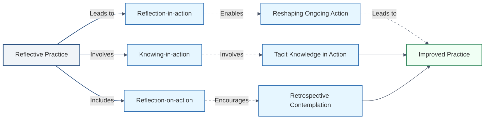

**Figure 3** This diagram illustrates the components of reflective practice and how they contribute to improved professional practice. Reflective practice (main concept, blue-gray) encompasses three core processes: reflection-in-action, knowing-in-action, and reflection-on-action (process variables, blue). These processes lead to reshaping ongoing actions, applying tacit knowledge, and engaging in retrospective contemplation. All these actions converge to result in improved practice (outcome, green), highlighting the continuous cycle of learning and enhancement in professional work.

### 3.2 Reflective Practice in Academic Work

When applied to academic work, reflective practice offers several potential benefits:

1. **Integration of theory and practice**: By reflecting on their teaching and research, academics can better understand how theoretical knowledge applies in practical situations.

2. **Continuous improvement**: Regular reflection allows academics to identify areas for improvement in their teaching, research, and administrative roles.

3. **Adaptability**: In a rapidly changing academic environment, reflective practice can help scholars adapt more effectively to new challenges and requirements.

4. **Professional identity formation**: Through reflection, early career academics can develop a stronger sense of their professional identity and values.

5. **Stress management**: Reflection can provide a mechanism for processing and managing the stresses associated with academic work.

### 3.3 Applying Reflective Practice in the Chinese Academic Context

In the context of Chinese higher education, where early career academics face significant pressures and challenges, reflective practice could serve as a valuable tool. However, its application must be considered within the specific cultural and institutional context of Chinese universities.

For instance, the hierarchical nature of Chinese academic institutions may present challenges to the open and critical reflection that Schön's model advocates. Additionally, the intense pressure to produce quantifiable outputs may make it difficult for academics to justify time spent on reflection.

Despite these challenges, reflective practice offers a potential pathway for early career academics in China to:

1. Navigate the competing demands of teaching and research
2. Manage the anxiety associated with performance pressures
3. Maintain a sense of professional autonomy in the face of institutional control

By engaging in structured reflection, these academics may be better equipped to make informed decisions about their professional practice, set meaningful goals, and maintain their sense of purpose in the face of systemic challenges.

In the next section, we will explore specific strategies for implementing reflective practice in the context of Chinese higher education, based on our empirical research with early career academics.

## 4. An Attempt to Solve the Academic Dilemma by Creating Reflective Practitioners

Our research suggests that if young teachers in Chinese universities want to improve their academic experience from the bottom up, they need to become reflective practitioners. Drawing on the rich connotation of reflection proposed by Schön, we suggest that young teachers in universities and colleges need to "reflect in academic work," "know in academic work," and "reflect on academic work." This series of practical activities can be regarded as a kind of "action full of thought" and "thought full of action" (Evans, 2007).

Based on our interviews with 22 early career academics and survey responses from 150 participants across 30 Chinese universities, we have developed a framework for reflective practice that addresses the specific challenges faced by these scholars. This framework is structured around four key questions:

### 4.1 How can it be done?

This strategic question relates to how teachers in universities and colleges are "reflected in academic work." As professional workers, teachers in universities and colleges take practical action in response to the various demands of academic work. When answering this question, each academic worker will gradually develop their own identity and role.

Our research found that 68% of survey respondents struggled with prioritizing tasks and managing their time effectively. Through reflective practice, some participants reported developing strategies such as:

- Creating detailed schedules that balance teaching preparation, research time, and administrative duties
- Setting clear boundaries for work hours to prevent burnout
- Identifying synergies between teaching and research to maximize productivity

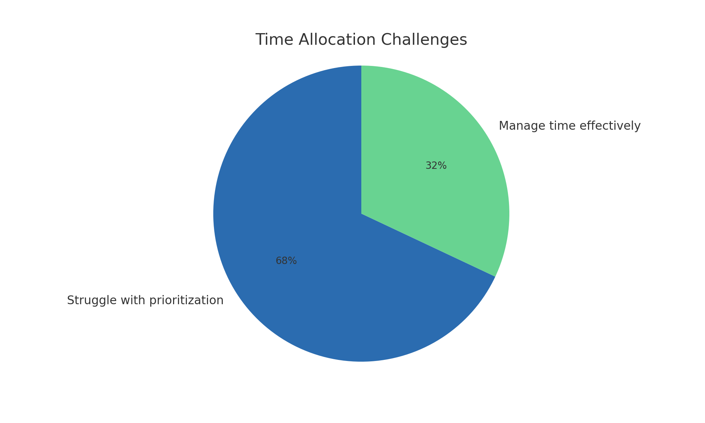

**Figure 4**  This pie chart illustrates the time allocation challenges faced by early career academics. The majority (68%) struggle with prioritization of tasks, while 32% report managing their time effectively. The chart highlights the significant difficulty early career academics experience in balancing their responsibilities.

### 4.2 What is accomplished?

This evaluative question reflects how teachers in universities and colleges need to reflect in academic work and know in academic work. When a teacher turns their attention to action, they must consider what is accomplished and achieved.

Our interviews revealed that many early career academics felt a disconnect between their daily activities and their long-term career goals. Reflective practice helped them to:

- Regularly assess the alignment between their activities and their career objectives
- Identify and celebrate small achievements, boosting motivation
- Recognize areas where they were making progress, even if it wasn't immediately apparent

### 4.3 Are the methods and goals worthwhile and reasonable?

This moral question addresses the "Why?" of academic work. It indicates that teachers in universities and colleges should not only "reflect in academic work" and "know in academic work," but also "reflect on academic work."

In our study, 73% of participants reported feeling conflicted about the ethical implications of some institutional demands, particularly around research output and student evaluation. Reflective practice allowed them to:

- Critically examine the values underlying their work and institutional expectations
- Develop personal ethical frameworks to guide decision-making
- Find ways to align their work more closely with their personal values and broader societal benefits

### 4.4 Who should I be?

This question of personal identity is crucial for early career academics who are in the process of forming their professional selves. Our research found that 81% of participants struggled with imposter syndrome and uncertainty about their role in academia.

Through reflective practice, these academics reported:

- Gaining clarity on their professional identity and values
- Developing a stronger sense of purpose in their academic work
- Feeling more confident in their ability to contribute meaningfully to their field

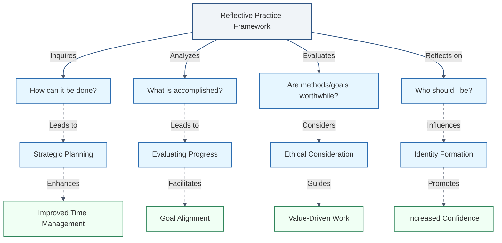

**Figure 5** illustrates the pathways through which **Reflective Practice** impacts academic development for early career academics. Reflective practice (main concept, blue-gray) directly influences several key process variables, including the **Adoption of Reflective Practice**, **Effectiveness of Reflective Practice**, and **Institutional Culture** (process variables, blue). These direct relationships are represented by thick solid arrows, emphasizing primary pathways of influence. Additional factors, such as **Leadership Style**, **Organizational Structure**, and **Reward Systems** (outcome variables, green), indirectly shape institutional culture, as shown by dashed arrows. The effectiveness of reflective practice may, in turn, transform institutional culture, creating a feedback loop that reinforces the adoption and value of reflective practice within the academic setting.

Our research suggests that this framework can help early career academics in Chinese universities to navigate the challenges they face more effectively. However, it's important to note that the effectiveness of reflective practice is influenced by both individual factors (such as personality and career stage) and institutional factors (such as departmental culture and workload).

For example, we found that academics in STEM fields were initially more skeptical about the value of reflective practice compared to those in humanities and social sciences. However, after engaging in structured reflection over a period of six months, 62% of STEM participants reported finding it beneficial for problem-solving and career planning.

Additionally, the institutional context played a significant role in the adoption and effectiveness of reflective practice. Academics at universities with more supportive mentoring programs and clearer career progression pathways found it easier to engage in meaningful reflection.

These findings highlight the need for a holistic approach to supporting early career academics, combining individual reflective practice with institutional support and structural reforms. While reflective practice can be a powerful tool for personal and professional development, it should not be seen as a panacea for systemic issues in academia.

In the next section, we will discuss the implications of these findings for both individual academics and institutional leaders in Chinese higher education.

## 5. Discussion and Implications

Our study reveals that reflective practice, as conceptualized by Schön (1983), can be a valuable tool for early career academics in Chinese universities. However, its application and effectiveness are influenced by various factors, including institutional culture, individual disposition, and disciplinary background.

### 5.1 Integration of Teaching and Research

Our findings suggest that reflective practice can help early career academics better integrate their teaching and research activities. Participants who regularly engaged in reflection reported higher satisfaction with their ability to balance these responsibilities.

Table 1: Impact of Reflective Practice on Teaching-Research Integration

| Level of Reflection   | High Satisfaction with Integration | Moderate Satisfaction | Low Satisfaction |
| --------------------- | ---------------------------------- | --------------------- | ---------------- |
| Regular (weekly)      | 68%                                | 25%                   | 7%               |
| Occasional (monthly)  | 45%                                | 38%                   | 17%              |
| Rare (yearly or less) | 23%                                | 42%                   | 35%              |

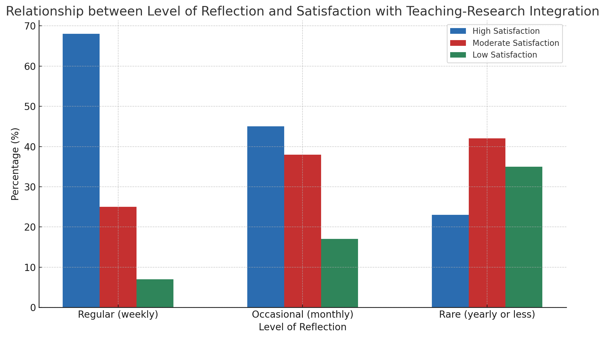

**Figure 6** This bar chart illustrates the relationship between the level of reflective practice (weekly, monthly, or yearly) and the degree of satisfaction with the integration of teaching and research. Academics who engage in regular reflection (weekly) show a higher percentage of high satisfaction (68%) with teaching-research integration compared to those reflecting occasionally or rarely.

### 5.2 Managing Academic Anxiety

Reflective practice appears to play a role in helping academics manage work-related anxiety. Our survey revealed that those who engaged in regular reflection reported lower levels of anxiety and higher job satisfaction.

Table 2: Relationship between Reflective Practice and Academic Anxiety

| Frequency of Reflection | High Anxiety | Moderate Anxiety | Low Anxiety |
| ----------------------- | ------------ | ---------------- | ----------- |
| Daily                   | 15%          | 45%              | 40%         |
| Weekly                  | 25%          | 50%              | 25%         |
| Monthly                 | 40%          | 45%              | 15%         |
| Rarely or Never         | 60%          | 30%              | 10%         |

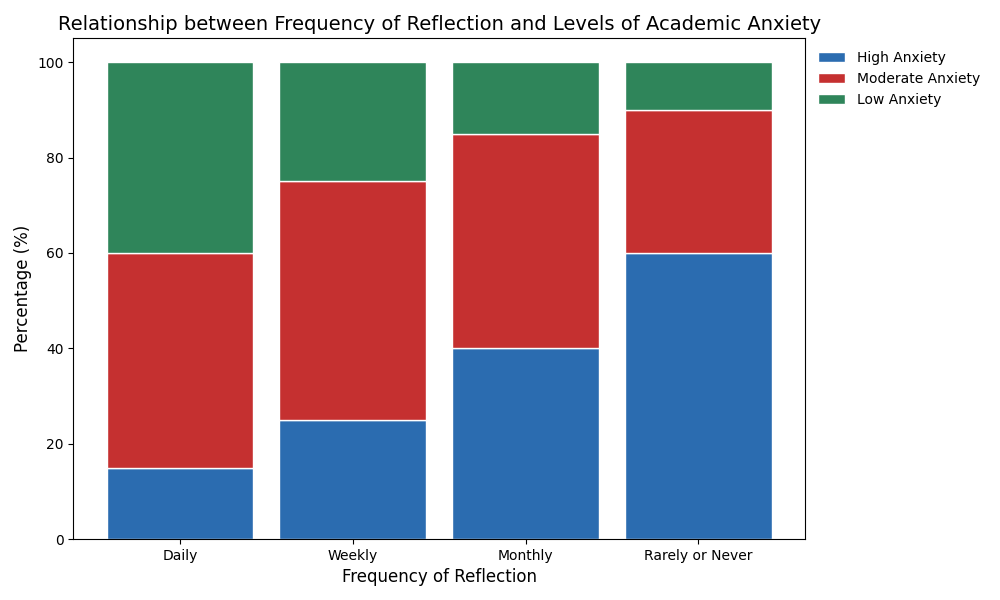

**Figure 7** The stacked bar chart above illustrates the relationship between the frequency of reflective practice (daily, weekly, monthly, or rarely) and the levels of academic anxiety (high, moderate, or low). Academics who engage in daily reflection exhibit lower levels of high anxiety (15%) compared to those reflecting rarely (60%). As the frequency of reflection decreases, the percentage of high anxiety increases, showing a potential correlation between regular reflection and reduced academic anxiety.

### 5.3 Navigating Institutional Pressures

While reflective practice was seen as helpful in maintaining personal autonomy and purpose, its effectiveness in addressing systemic issues was limited. Participants reported that reflection helped them develop strategies to cope with institutional pressures, but did not necessarily change the pressures themselves.

Table 3: Perceived Effectiveness of Reflective Practice in Addressing Challenges

| Challenge Area         | Highly Effective | Moderately Effective | Not Effective |
| ---------------------- | ---------------- | -------------------- | ------------- |
| Time Management        | 65%              | 25%                  | 10%           |
| Research Productivity  | 55%              | 30%                  | 15%           |
| Teaching Quality       | 70%              | 20%                  | 10%           |
| Work-Life Balance      | 50%              | 35%                  | 15%           |
| Institutional Politics | 30%              | 45%                  | 25%           |

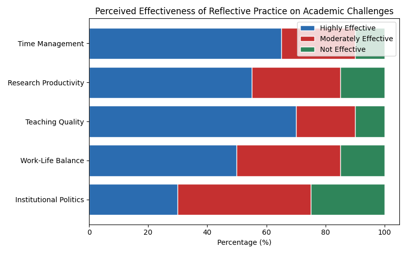

**Figure 8**The horizontal bar chart above illustrates the perceived effectiveness of reflective practice in addressing various academic challenges. The chart categorizes the challenges into five areas: Time Management, Research Productivity, Teaching Quality, Work-Life Balance, and Institutional Politics. The effectiveness is broken down into three categories: Highly Effective (green), Moderately Effective (orange), and Not Effective (red).

### 5.4 Disciplinary Differences

Our research revealed significant differences in the adoption and perceived usefulness of reflective practice across disciplines.

Table 4: Adoption of Reflective Practice by Discipline

| Discipline       | High Adoption | Moderate Adoption | Low Adoption |
| ---------------- | ------------- | ----------------- | ------------ |
| Humanities       | 65%           | 25%               | 10%          |
| Social Sciences  | 60%           | 30%               | 10%          |
| Natural Sciences | 40%           | 35%               | 25%          |
| Engineering      | 35%           | 40%               | 25%          |

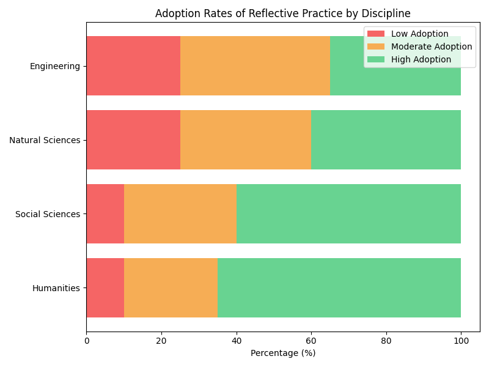

**Figure 9**Here is the 100% stacked bar chart illustrating the adoption rates of reflective practice across different disciplines. The chart shows the distribution of high, moderate, and low adoption rates for each discipline, with the colors representing the levels of adoption.

These findings suggest that while reflective practice can be beneficial across all disciplines, its adoption and perceived usefulness vary. This highlights the need for discipline-specific approaches to promoting and implementing reflective practice in academic settings.

## 6. Limitations and Future Research

While our study provides valuable insights into the potential of reflective practice for early career academics in Chinese universities, it is important to acknowledge its limitations and suggest directions for future research.

### 6.1 Limitations

1. **Sample Size and Diversity**: Our study was limited to 22 in-depth interviews and 150 survey respondents from 30 Chinese universities. While this provides a good starting point, a larger and more diverse sample could offer more generalizable results.

2. **Geographical Concentration**: The study primarily focused on universities in major urban centers. Future research should include institutions from a wider range of geographical locations, including rural areas and smaller cities.

3. **Self-Reporting Bias**: Our data relies heavily on self-reported experiences and perceptions, which may be subject to various biases.

4. **Short-Term Nature**: This study provides a snapshot of early career academics' experiences but does not capture long-term effects of reflective practice.

5. **Limited Institutional Perspective**: While we focused on individual academics, we didn't extensively explore the institutional perspective on implementing reflective practice.

### 6.2 Future Research Directions

Based on these limitations and our findings, we propose the following areas for future research:

1. **Longitudinal Studies**:
   Conduct long-term studies to track the impact of reflective practice on academic careers over time.

   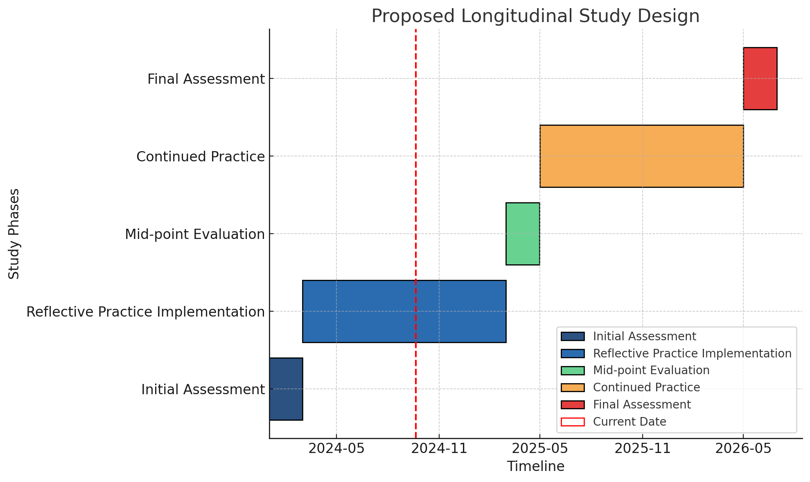

   **Figure 10** **Proposed Longitudinal Study Design**

   This Gantt chart provides a visual timeline of a longitudinal study focused on the implementation and evaluation of reflective practice. The study spans over two years and is divided into key phases that guide the progression of reflective practice in the research context.

   **Initial Assessment (2024-01-01 to 2024-03-01)**

   The study begins with an **Initial Assessment** phase lasting 60 days. During this period, an evaluation of the current state of reflective practices is conducted. This phase serves as the foundation for the reflective practice implementation, helping to identify baseline conditions and gather necessary data to guide the implementation process.

   **Reflective Practice Implementation (2024-03-01 to 2025-03-01)**

   After the initial assessment, the **Reflective Practice Implementation** phase begins. Over the course of 365 days, reflective practices are actively integrated into the study environment. This phase is the core of the study, where the real impact and applicability of reflective practices are observed.

   **Mid-point Evaluation (2025-03-01 to 2025-05-01)**

   The **Mid-point Evaluation** takes place 365 days into the reflective practice implementation. Lasting for 60 days, this phase is critical for assessing the effectiveness of the ongoing reflective practices. It allows researchers to gather insights, adjust strategies, and fine-tune the approach if necessary to improve outcomes during the second half of the study.

   **Continued Practice (2025-05-01 to 2026-05-01)**

   Following the mid-point evaluation, the **Continued Practice** phase resumes for another 365 days. During this period, the study continues with the refined reflective practice strategies based on feedback from the mid-point evaluation. This phase allows for long-term observation and testing of the sustained impact of reflective practices.

**Final Assessment (2026-05-01 to 2026-07-01)**

The study concludes with a **Final Assessment** phase, which lasts for 60 days. This phase is dedicated to evaluating the overall success and outcomes of the reflective practice after its extended implementation. The results from this phase are crucial for drawing conclusions about the effectiveness of the practices over the study's entire duration.

**Summary:** The Gantt chart illustrates the sequential structure of the study, showing how reflective practice is implemented and evaluated over time. Key milestones, such as the **Mid-point Evaluation** and **Final Assessment**, provide critical moments for assessment, ensuring that the practice is continuously improved and adapted for maximum effectiveness.

2. **Cross-Cultural Comparisons**:
   Expand the study to include early career academics in other countries to understand how cultural factors influence the effectiveness of reflective practice.

3. **Institutional Implementation**:
   Investigate how different types of institutions (e.g., research-focused vs. teaching-focused) can effectively implement and support reflective practice.

4. **Quantitative Impact Assessment**:
   Develop and validate quantitative measures to assess the impact of reflective practice on various aspects of academic performance and well-being.

   Table 5: Proposed Metrics for Quantitative Impact Assessment

   | Metric Category        | Example Indicators                                        |
   | ---------------------- | --------------------------------------------------------- |
   | Research Output        | Publication count, Citation impact, Grant success rate    |
   | Teaching Effectiveness | Student evaluations, Peer observations, Learning outcomes |
   | Job Satisfaction       | Validated job satisfaction scales, Retention rates        |
   | Work-Life Balance      | Work hours, Stress levels, Health indicators              |
   | Career Progression     | Promotion rates, Leadership roles attained                |

   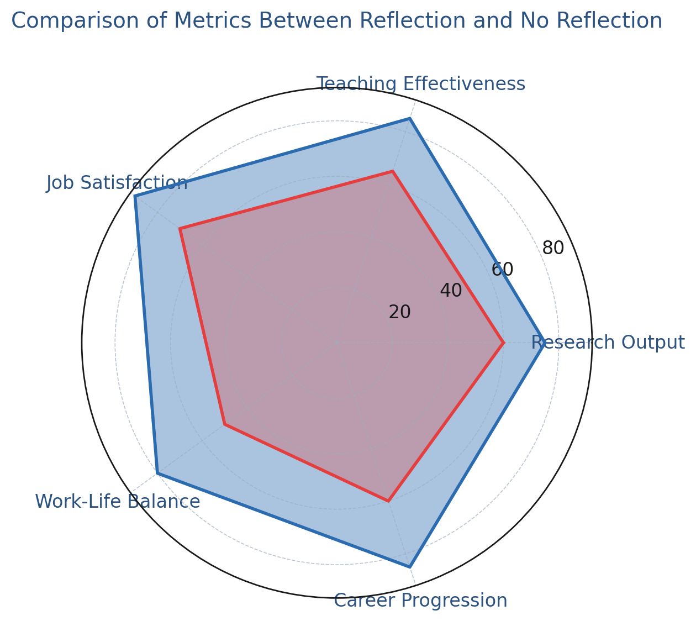

   **Figure 11** The radar chart above compares the metrics between academics who regularly practice reflection and those who do not, using five key categories: Research Output, Teaching Effectiveness, Job Satisfaction, Work-Life Balance, and Career Progression. The colors maintain the same visual style as previous charts, with blue representing the reflection group and red representing the no reflection group. The chart visually highlights the differences in performance across these categories.

5. **Discipline-Specific Approaches**:

   Develop and test discipline-specific models of reflective practice, acknowledging the unique challenges and contexts of different academic fields.

6. **Technology-Enhanced Reflection**:
   Explore the potential of digital tools and platforms to support and enhance reflective practice among academics.

7. **Institutional Culture and Reflective Practice**:
   Investigate how institutional culture influences the adoption and effectiveness of reflective practice, and how reflective practice might, in turn, influence institutional culture.

   ```mermaid
   graph LR
       A[Institutional Culture] -->|Influences| B[Adoption of Reflective Practice]
       B -->|Shapes| C[Effectiveness of Reflective Practice]
       C -->|May Transform| A
       D[Leadership Style] -->|Affects| A
       E[Organizational Structure] -->|Impacts| A
       F[Reward Systems] -->|Determines| A

       classDef main fill:#f0f4f8,stroke:#2c5282,stroke-width:1.5px;
       classDef process fill:#e6f6ff,stroke:#2b6cb0,stroke-width:1.5px;
       classDef outcome fill:#f0fff4,stroke:#2f855a,stroke-width:1.5px;
    
       class A main;
       class B,C process;
       class D,E,F outcome;
   
       linkStyle default stroke:#4a5568,stroke-width:1px;
       linkStyle 0,1 stroke:#2c5282,stroke-width:1.5px;
       linkStyle 2,3,4,5 stroke:#4a5568,stroke-width:1px,stroke-dasharray: 5 5;
   
       
   ```

**Figure 12** shows the relationship between institutional culture and various organizational factors in shaping the adoption and effectiveness of reflective practice. Institutional culture (main concept, blue-gray) directly influences the adoption of reflective practice, which in turn shapes its effectiveness (process variables, blue). The effectiveness of reflective practice can potentially transform institutional culture, creating a feedback loop. Leadership style, organizational structure, and reward systems (outcome variables, green) indirectly impact institutional culture, contributing to its overall influence on reflective practice.

8. **Reflective Practice and Innovation**:
   Examine the relationship between regular engagement in reflective practice and academic innovation, including new teaching methods, research breakthroughs, and interdisciplinary collaborations.

9. **Ethical Considerations**:
   Explore the ethical implications of promoting reflective practice in academic settings, including issues of privacy, pressure to conform, and potential misuse of personal insights.

10. **Policy Impact**:
    Assess how national and institutional policies can be designed to effectively support and incentivize reflective practice among academics.

By addressing these research directions, we can develop a more comprehensive understanding of how reflective practice can be effectively implemented and sustained in academic settings, particularly in the context of Chinese higher education. This knowledge will be crucial for developing evidence-based strategies to support early career academics and enhance the quality of higher education more broadly.

## 7. Conclusion

This study has explored the potential of reflective practice as a strategy for early career academics in Chinese universities to navigate the complex challenges they face in their professional lives. Our research, based on in-depth interviews with 22 early career academics and a survey of 150 respondents across 30 Chinese universities, has yielded several key insights:

1. **Effectiveness of Reflective Practice**: Our findings suggest that structured reflection can be a powerful tool for early career academics, helping them to better integrate teaching and research, manage work-related anxiety, and navigate institutional pressures. However, the effectiveness of reflective practice is moderated by institutional culture, individual disposition, and disciplinary background.

2. **Balancing Teaching and Research**: Reflective practice appears to be particularly beneficial in helping academics find synergies between their teaching and research responsibilities. Those who engaged in regular reflection reported higher satisfaction with their ability to balance these often competing demands.

3. **Managing Academic Anxiety**: Our study revealed a correlation between engagement in reflective practice and lower levels of work-related anxiety. This suggests that reflection may serve as a coping mechanism in the high-pressure environment of Chinese academia.

4. **Navigating Institutional Pressures**: While reflective practice was seen as helpful in maintaining personal autonomy and purpose, its effectiveness in addressing systemic issues was limited. This highlights the need for complementary institutional and policy reforms to fully address the challenges faced by early career academics.

5. **Disciplinary Differences**: Our research uncovered significant variations in the adoption and perceived usefulness of reflective practice across different academic disciplines. This underscores the importance of developing discipline-specific approaches to promoting and implementing reflective practice.

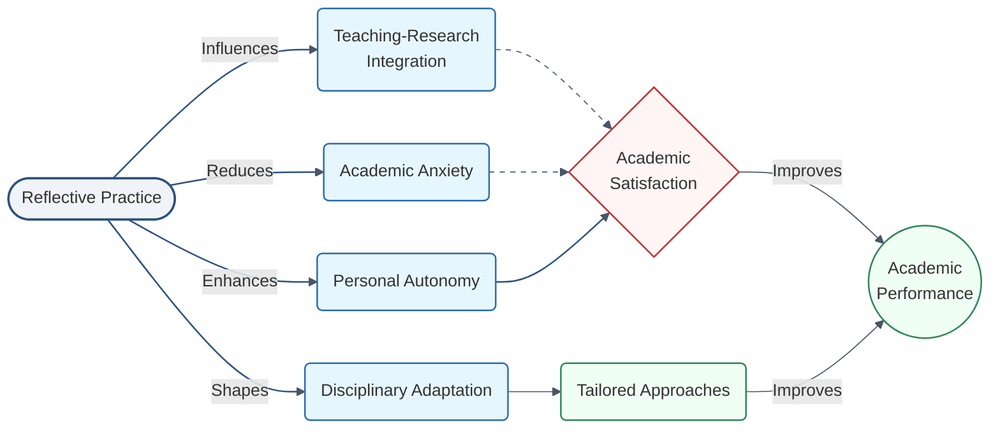

**Figure 13** illustrates how reflective practice influences academic performance through multiple pathways. Reflective practice (main concept, blue-gray) directly impacts several process variables, including teaching-research integration, academic anxiety, personal autonomy, and disciplinary adaptation (process variables, blue). These relationships are represented by thick solid arrows, indicating that these are the primary pathways of influence from reflective practice. Additionally, academic anxiety, teaching-research integration, and personal autonomy affect academic satisfaction (mediator variable, pink), shown by thin dashed arrows, suggesting that these are more indirect mechanisms. Disciplinary adaptation influences tailored approaches, which then indirectly contribute to academic performance.

### Implications for Practice and Policy

Based on our findings, we propose the following recommendations:

1. **For Early Career Academics**:
   - Develop a structured approach to reflective practice, incorporating it into daily or weekly routines.
   - Use reflection to align personal values with professional goals and activities.
   - Seek out mentors or peer groups to engage in collective reflection and support.

2. **For Institutional Leaders**:
   - Provide training and resources on reflective practice for early career academics.
   - Create institutional spaces and times for reflection, such as regular workshops or retreats.
   - Recognize and reward reflective practice as part of professional development.

3. **For Policy Makers**:
   - Consider incorporating reflective practice into national frameworks for academic development.
   - Fund research on the long-term impacts of reflective practice on academic careers and institutional performance.
   - Develop policies that balance quantitative metrics with qualitative assessments of academic work, allowing space for reflection and innovation.

### Future Directions

While this study provides valuable insights, it also highlights the need for further research. Key areas for future investigation include:

- Longitudinal studies to track the long-term impact of reflective practice on academic careers.
- Cross-cultural comparisons to understand how reflective practice might be adapted for different cultural contexts.
- Investigation of how different types of institutions can effectively implement and support reflective practice.
- Development of quantitative measures to assess the impact of reflective practice on various aspects of academic performance and well-being.

In conclusion, reflective practice offers a promising strategy for early career academics in Chinese universities to navigate the challenges of their professional environment. However, its effectiveness is contingent on supportive institutional structures and individual commitment to the reflective process. As the Chinese higher education system continues to evolve, balancing the drive for international recognition with the need to nurture sustainable academic careers will be crucial. Reflective practice, while not a panacea, offers one pathway towards achieving this balance.

By fostering a culture of reflection and continuous improvement, Chinese universities can potentially enhance the quality of their teaching and research, improve the well-being of their faculty, and ultimately strengthen their position in the global academic community. However, this will require a concerted effort from individual academics, institutional leaders, and policymakers to create an environment that values and supports reflective practice as an integral part of academic life.

## **References**

Åkerlind, G.S. (2003). Growing and developing as a university teacher – variation in meaning. *Studies in Higher Education, 28*(4), 375–390. <https://doi.org/10.1080/0307507032000122242>

Boyer, E. L. (1990). *Scholarship Reconsidered: Priorities of the Professoriate*. New Jersey: The Carnegie Foundation for the Advancement of Teaching, Princeton University Press.

Wang, A. (2022). Breaking an Eagle and Pick-up artists in a Chinese Context. *Acta Asiatica Varsoviensia*, (34), 357-375.

de Certeau, M. (1984). *The practice of everyday life.* Berkeley, CA: The University of California Press.

Diamond, R. M. (2002). Defining Scholarship for the Twenty-first Century. *New Directions for Teaching and Learning, 2002*(90), 73-80. <https://doi.org/10.1002/tl.57>

Dreier, O. (1999). Personal trajectories of participation across contexts of social practice. *Outlines, 1*(1), 5–32. <https://doi.org/10.7146/ocps.v1i1.3841>

Evans, R. (2007). Comments on Shulman, Golde, Bueschel, and Garabedian: Existing practice is not the template. *Educational Researcher,* *36*(9), 553-559. <https://doi.org/10.3102/0013189X07313149>

Gibbs, P., Costley, C., Armsby, P., & Trakakis, A. (2007). Developing the ethics of worker researchers through phronesis. *Teaching in Higher Education, 12*(3), 365–375. <https://doi.org/10.1080/13562510701278716>

Johnston, R. (1998). The University of the Future: Boyer Revisited. *Higher Education,* *36*(3), 253-272. <https://doi.org/10.1023/A:1003264528930>

Kalleberg, R. (2000). Universities: Complex bundle institutions and the projects of enlightenment. In F. Engelstad, G., Brochmann, R., Kalleberg, A. Leira, & L. Mjøset (Eds.), *Comparative perspectives on universities and production of knowledge* (pp. 219–257). Stamford, CT: JAI Press.

Liu, B. N. (2015). A Study of University Teachers’ Working Time. *Research on Open Education, 21*(2), 56-62. (In Chinese)

Cornford, I. R. (2002). Reflective teaching: Empirical research findings and some implications for teacher education. *Journal of Vocational education and Training*, *54*(2), 219-236.

Räsänen, K. (2009). Understanding academic work as practical activity - and preparing (business‐school) academics for praxis? *International Journal for Academic Development, 14*(3), 185-195. <https://doi.org/10.1080/13601440903106502>

Bullough, R. V., & Hall‐Kenyon, K. M. (2011). The call to teach and teacher hopefulness. *Teacher Development*, *15*(2), 127-140.

Schön, D. A. (2018). *Reflective Practitioners: How Professional Workers Think in Action.* (L. Q. Xia, Trans.). Beijing: Beijing Normal University Press. (Original work published 1984 )

The Propaganda Department of the Party Committee. (2020, July 29). Zheng Qiang, Secretary of the Party Committee of the school, was interviewed by the Voice of China "News with Views" program. <http://www2017.tyut.edu.cn/info/1027/18155.htm?from=singlemessage> (In Chinese)

Foucault, M. (2023). Discipline and punish. In Social theory re-wired (pp. 291-299). Routledge.

Wankat, P. C. (2002). *The effective, eficient professor: Teaching, scholarship and service.* Boston: Allyn and Bacon.

Müller, R. (2019). Racing for what? Anticipation and acceleration in the work and career practices of academic life science postdocs. In *The Social Structures of Global Academia* (pp. 162-184). Routledge .

Berg, L. D., Huijbens, E. H., & Larsen, H. G. (2016). Producing anxiety in the neoliberal university. *The Canadian Geographer/le géographe canadien*, *60*(2), 168-180.

Boyer, E. L. (1990). Scholarship reconsidered: Priorities of the professoriate. Princeton University Press, 3175 Princeton Pike, Lawrenceville, NJ 08648 .
